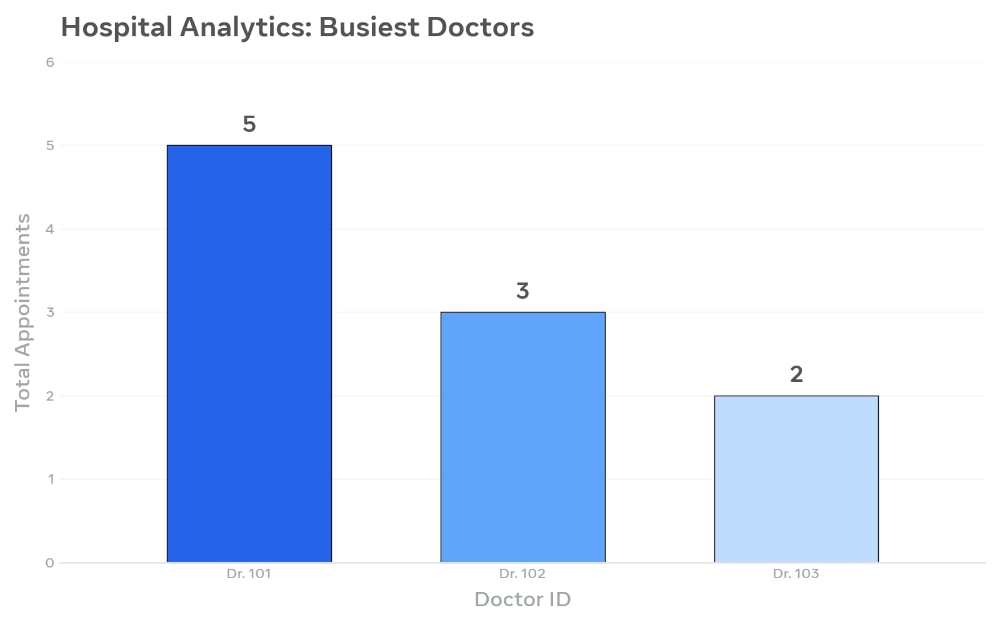

# hospital-appointment-analysis

My first Data Science project - Finding busiest doctors using Python

## Project Overview
This project analyzes hospital appointment data to find which doctors are the busiest.

## Files in this repository
- analysis.py - Python code for analysis
- chart.png - Bar chart showing busiest doctors

## Result

## What I Learned
- How to use Pandas for data analysis
- How to create bar charts with Matplotlib
- How to upload a project to GitHub
